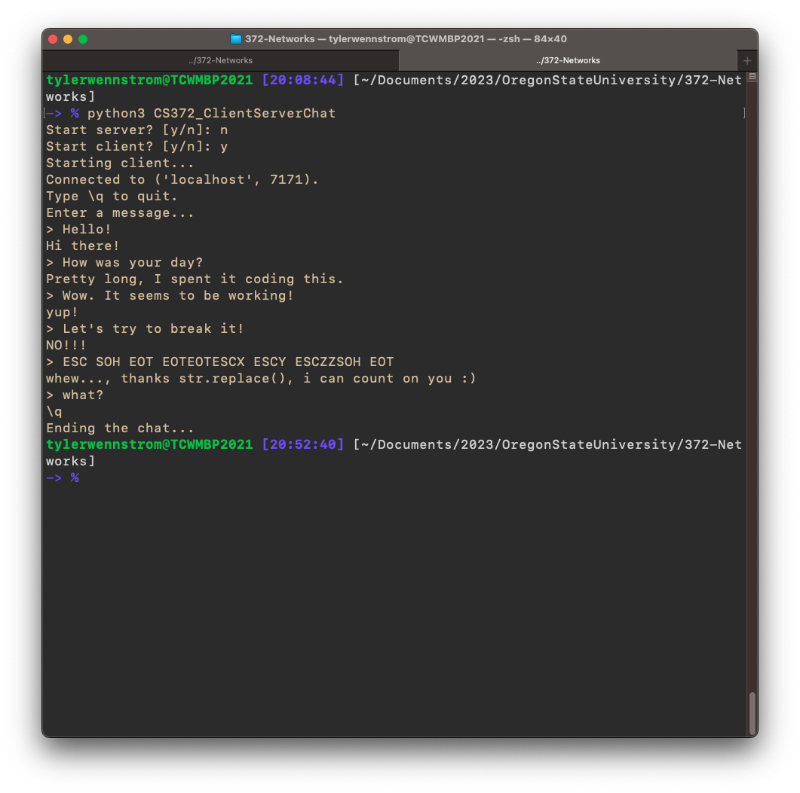
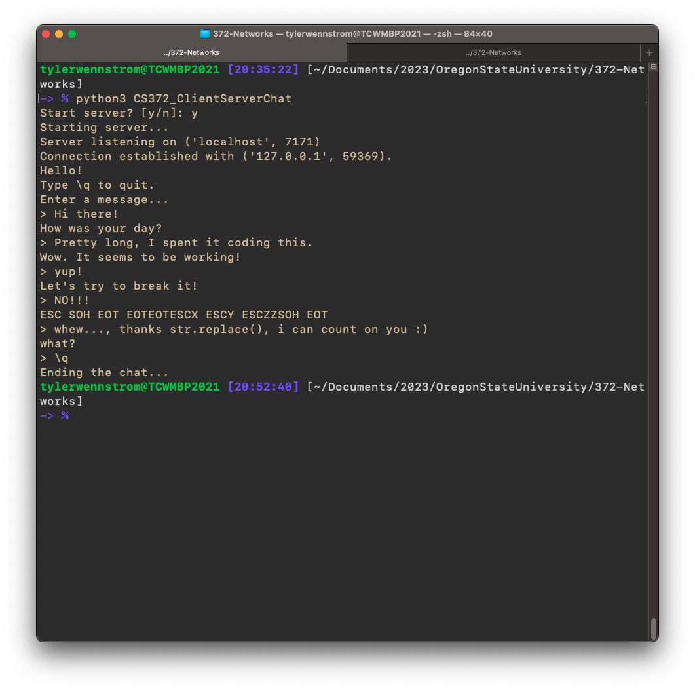

# Client Server Chat

## About

- Author: Tyler Wennstrom
- School: Oregon State University
- Term: Winter 2023
- Class: CS 372 Introduction to Computer Networks
- Assignment: Programming Project Client Server Chat

## Installation

CS372_ClientServerChat requires Python 3.10 to run. Before running any scripts,
please install Python 3.10 or newer.

To install CS372_ClientServerChat, download this repo to a directory of choice
on your local machine. If you have downloaded a .zip of this package, unzip
the package into a directory of choice on your local machine, and skip the
shell command below.

```bash
git clone https://github.com/tcw7/CS372_ClientServerChat.git
```

## Usage

To run CS372_ClientServerChat, navigate to the directory where 
CS372_ClientServerChat is installed.

```bash
cd ~
ls -al
# .
# ..
# your_files
# ...
# CS372_ClientServerChat
# ...
```

Next, run CS372_ClientServerChat using Python3:

```bash
python3 CS372_ClientServerChat
```

**NOTE: It is not required to enter the package CS372_ClientServerChat to run**
**the main script. If you enter the main package, you can alternatively run**
**```__main__.py```, however this project is intended to be run as a package.**

As an alternative,
to run the main script explicitly, change your working directory into
CS372_ClientServerChat, and run ```__main__.py``` using Python3:

```bash
python3 __main__.py
```

### Starting the Server

After running the package, you will prompted to begin start a server. Enter
"y" to start the server. The program will guide you from this point on.

```bash
python3 CS372_ClientServerChat
# Start server? [y/n]: y
# Starting server...
# Server listening on ('localhost', 7171)
```

### Starting the Client

Once an instance of the Server is running and listening for connections, open
a new shell window, and run CS372_ClientServerChat. This time, deny the Server
prompt. Next, you will see a client prompt; enter "y" to start the client.
The program will guide you from this point on.

```bash
python3 CS372_ClientServerChat
# Start server? [y/n]: n
# Start client? [y/n]: y
# Starting client...
# Connected to ('localhost', 7171).
# Type \q to quit
# Enter a message...
```

### Exchanging messages

Once the server and client are connected to each other, you can freely send
messages from your respective shell windows to each other. To end the chat,
enter "\q" as a message from either the server or client. This will close the
connection and end the program.

## Screenshots of the program

Running Client:



Running Server:



## Resources Referenced

[\_\_init\_\_.py guide](https://blog.christoolivier.com/p/what-is-up-with-__init__-py-and-__main__-py)

[\_\_init\_\_.py structure](https://stackoverflow.com/questions/67100775/how-to-write-python-init-py-file-for-module)

[Python modules and packages](https://realpython.com/python-modules-packages/#the-module-search-path)

[Python3 socket docs](https://docs.python.org/3/library/socket.html#socket.socket.connect)

[StringIO guide](https://www.geeksforgeeks.org/stringio-module-in-python/)

[bytes encoding/decoding](https://stackoverflow.com/questions/14472650/python-3-encode-decode-vs-bytes-str)